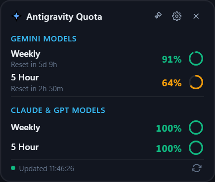
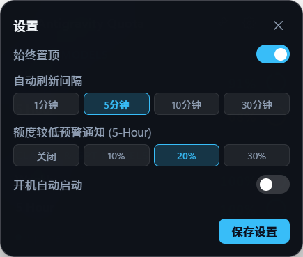

# Antigravity Quota Widget (Windows 11 桌面额度悬浮窗)

专为 Windows 11 设计的现代化、轻量级 **Antigravity / Gemini & Claude Models 真实额度桌面悬浮窗**。

无需手动抓包、无需复制 Cookie / Token，直接全自动对接本机 Antigravity 后端服务获取 100% 真实的额度数据。

---

## 📸 运行效果预览

| 主悬浮窗卡片 | 实时设置面板 |
| :---: | :---: |
|  |  |

---

## 🌟 核心特性

1. **真实数据源（零模拟、零配置）**
   - 自动检测本机运行中的 `language_server.exe` 进程，提取专属 CSRF Token 与本地监听端口。
   - 直接调用本地 RPC 端点 `/exa.language_server_pb.LanguageServerService/RetrieveUserQuotaSummary`，毫秒级获取最精准的实时数据。
   - 支持 Antigravity 重启后自动静默重连，无需用户任何干预。

2. **监控 4 项核心额度与绝对/相对时间双显示**
   - **Gemini Weekly Remaining**（百分比、圆形环、如 `Reset in 5d 9h (10/12 15:23)`）
   - **Gemini 5-Hour Remaining**（百分比、圆形环、如 `Reset in 2h 15m (15:23)`）
   - **Claude/GPT Weekly Remaining**（百分比、圆形环）
   - **Claude/GPT 5-Hour Remaining**（百分比、圆形环）
   - 额度变动指示徽章（如 `↓ -12%` / `↑ +50%`）。

3. **💊 迷你胶囊模式（Mini Capsule Mode）**
   - 双击空白区域、胶囊条或点击展开/收起按钮即可秒级切换。
   - 紧凑胶囊高度仅 38px，极度节省屏幕空间，随时掌握核心额度。
   - 胶囊模式下同样支持自由拖拽移动与边缘磁吸。

4. **🪟 不透明度调节与智能悬停**
   - 支持 20% ~ 100% 窗口不透明度无级调节。
   - 调节时实时半透明预览透视桌面。
   - 平时保持设定透明度，**鼠标悬停时自动恢复 100% 不透明**以确保阅读清晰，鼠标移开自动恢复半透明。

5. **🎨 Windows 11 Fluent 双主题切换**
   - 一键切换深色（Dark Acrylic）与浅色（Fluent Light）主题。
   - 深浅模式自带专属配色体系，设置滚动条自适应配色。

6. **🧲 边缘磁吸与多显示器智能记忆**
   - 靠近屏幕上下左右边缘自动磁吸对齐。
   - 完美适配多显示器/副屏环境，记忆并保存在对应屏幕的坐标位置。

7. **系统托盘与自启**
   - 任务栏托盘图标，双击显隐窗口。
   - 右键托盘菜单：显示/隐藏、固定右上角、立即刷新、迷你模式、窗口置顶、开机自启、退出。
   - 开机自动启动（通过注册表 `HKCU\...\Run` 管理）。

8. **额度预警与满血恢复通知**
   - 5-Hour 额度低于设定阈值（10%/20%/30%/关闭）时通过 Windows 系统托盘气泡通知提醒（周期内防刷）。
   - 额度恢复至 100% 时自动发送满血恢复通知。

9. **极低资源占用**
   - 基于 .NET 10 + WebView2 现代化架构，内存占用常驻仅约 **19.5 MB**。

---

## 🚀 启动与使用

### 方式 1：一键运行（绿色免安装）
双击运行根目录下的脚本：
```bat
start_widget.bat
```
或者直接运行：
```cmd
.\dist\AntigravityQuotaWidget.exe
```

### 方式 2：使用 Node.js 终端快速查额度
如果不打开悬浮窗，也可以在终端中执行：
```bash
node check_quota.mjs
```

---

## 🛠 源码架构

```
gemini_usage/
├── dist/                              # 已发布的 Release 独立产物
│   ├── AntigravityQuotaWidget.exe     # 主程序
│   ├── wwwroot/                       # 前端 UI 资源
│   └── ...
├── AntigravityQuotaWidget/            # C# / .NET 10 + WebView2 源码工程
│   ├── Models/
│   │   ├── QuotaData.cs               # 额度数据模型 (Gemini, Claude/GPT, Buckets)
│   │   └── WidgetSettings.cs          # 窗口设置模型 (置顶、刷新间隔、透明度等)
│   ├── Services/
│   │   ├── AntigravityService.cs      # 逆向接口服务 (进程嗅探, Token提取, 本地RPC通信)
│   │   ├── QuotaService.cs            # 定时轮询调度、本地倒计时递减计算、错误缓存保持
│   │   ├── NotificationService.cs     # Windows 托盘气泡通知与周期防重
│   │   └── SettingsService.cs         # 本地配置存储与注册表自启管理
│   ├── wwwroot/
│   │   ├── index.html                 # 紧凑悬浮窗结构
│   │   ├── style.css                  # Win11 毛玻璃、圆形进度环动画样式
│   │   └── app.js                     # 视图渲染、设置弹层、双向通信逻辑
│   ├── MainWindow.xaml / .xaml.cs     # 无边框透明窗口、托盘图标、WebView2 桥接
│   └── App.xaml / .xaml.cs
├── check_quota.mjs                    # 独立 Node.js 额度逆向验证脚本
└── start_widget.bat                   # 一键启动批处理
```

---

## ⚙ 自定义设置说明

在悬浮窗右上角点击齿轮 **⚙** 图标，即可展开设置面板：
- **始终置顶**：窗口是否浮动于所有窗口上方。
- **开机自启**：随 Windows 系统开机自动启动。
- **额度恢复通知**：额度回满时气泡提醒。
- **边缘吸附**：靠近屏幕边缘自动磁吸。
- **窗口不透明度**：20% ~ 100% 自由拖动滑块调节。
- **自动刷新间隔**：1 分钟、5 分钟、10 分钟、30 分钟。
- **额度较低预警通知**：关闭、10%、20%、30%。

---

## 📄 License

MIT License
